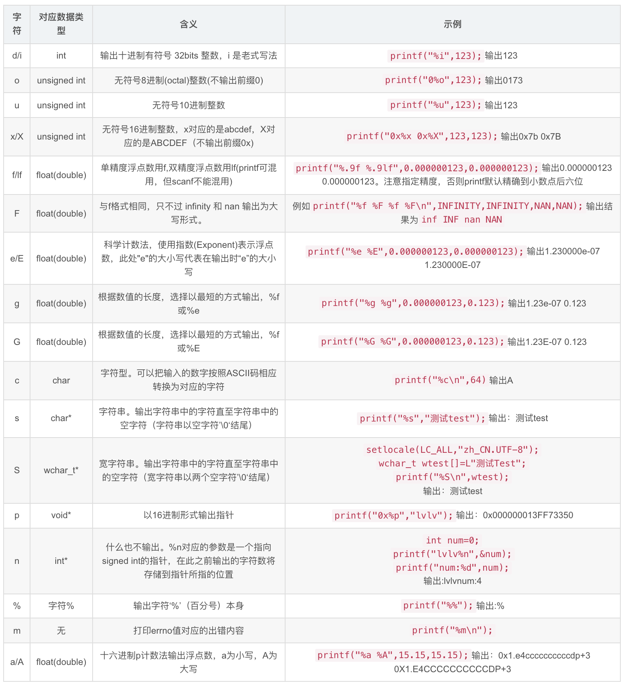
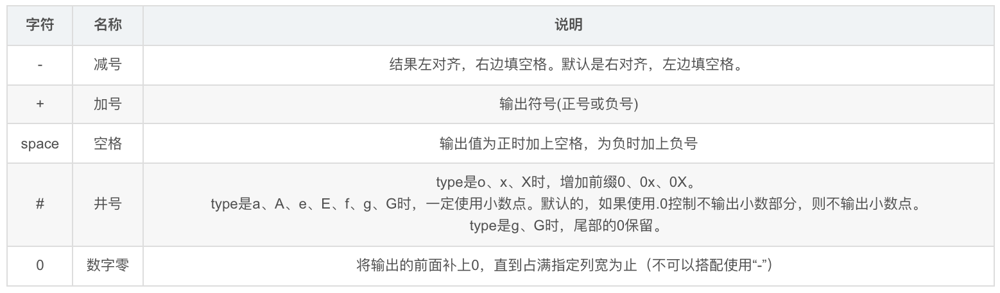
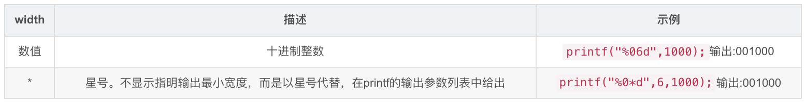
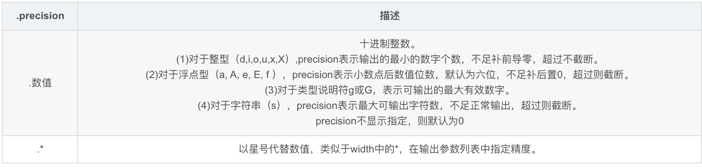
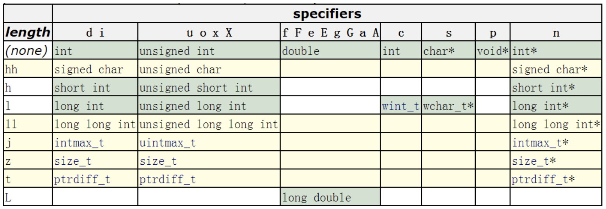

&emsp;
# 1 C语言stdio.h中的IO
&emsp;&emsp;在 C语言中，没有专门的输入输出语句，所有的输入输出操作都是通过对标准输入输出库函数（包含在 stdio.h 头文件中）的调用实现。最常用的输入输出函数有 scanf（）、printf（）、getchar（）和 putchar（）

&emsp;
## 1.1 scanf()
&emsp;&emsp;格式化输入函数 scanf（）的功能是取得从键盘上输入的数据，所获得的数据按指定输入格式被赋给相应的输入项。该函数一般形式为∶
```
scanf("%<修饰符>格式字符", 输入项列表)
```

- 修饰符: 可选，表示输入字段宽度（数字）、约定整数是否是长整型（l）
- 格式字符数据类型

    

（2）输入项列表

- 一个或多个变量地址，变量地址有多个时，用逗号"，"分隔。  

- 变量要加取地址操作符"&"， 只有这样函数才能改变其值。

- 输入类型与变量类型应尽量一致，以避免类型不匹配而造成的错误。

&emsp;&emsp;如果需要输入一个十进制长整型数据，且规定字段宽度为 9 位有效数字，可用下面的代码完成。

&emsp;
>示例
```c++
#include <iostream>
using namespace std;

int main()
{
    // 示例1：
    long a;            //声明一个长整型变量
    scanf("%9ld", &a); //输入一个字段宽度为 9 位有效数字的十进制长整型数据，保存在变量a中

    /*程序运行时，会要求在终端上输入数据，输入后按 Enter 键，程序继续运行。假如输入的数据是 1234567890，那么前 9 位数字将作为有效的输入，变量 a 保存的数值为 123456789。*/

    // 示例2：
    int a, b, c; //声明 3个整型变量
    //输入3个整型数据，分别保存在变量 a、b、c中, 注意用逗号隔开
    scanf("%d, %d, %d", &a, &b, &c); 
    printf("%d, %d, %d\n", a, b, c);
}
```


&emsp;
## 1.2 printf()
- 按格式化字符串输出
>基本格式
```c++
printf("%[标志][输出最小宽度][.精度][长度][类型]"，输出项列表)
```

&emsp;
>[类型] 



&emsp;
>[标志] 


```c++
#include <iostream>
using namespace std;

int main()
{
    printf("%5d\n",1000); 				 //默认右对齐,左边补空格
    printf("%-5d\n",1000); 				 //左对齐,右边补空格
    printf("%+d %+d\n",1000,-1000);		 //输出正负号
    printf("% d % d\n",1000,-1000);		 //正号用空格替代，负号输出
    printf("%x %#x\n",1000,1000);		 //输出0x
    printf("%.0f %#.0f\n",1000.0,1000.0);//当小数点后不输出值时依然输出小数点
    printf("%g %#g\n",1000.0,1000.0);	 //保留小数点后后的0
    printf("%05d\n",1000);				 //前面补0
}
```

&emsp;
>[输出最小宽度] : 



&emsp;
>[.精度]


```c++
printf("%.8d\n",1000);			//不足指定宽度补前导0，效果等同于%08d
printf("%.8f\n",1000.123456789);//超过精度，截断
printf("%.8f\n",1000.123456);	//不足精度，补后置0
printf("%.8g\n",1000.123456);	//最大有效数字为8位
printf("%.8s\n",“abcdefghij”);	//超过指定长度截断
```

&emsp;
>[长度]


```c++
#include <iostream>
using namespace std;

int main()
{
    printf("%hhd\n",'A');				//输出有符号char
    printf("%hhu\n",'A'+128);			//输出无符号char
    printf("%hd\n",32767);				//输出有符号短整型short int
    printf("%hu\n",65535);				//输出无符号短整型unsigned short int
    printf("%ld\n",0x7fffffffffffffff);	//输出有符号长整型long int
    printf("%lu\n",0xffffffffffffffff);	//输出有符号长整型unsigned long int
}
```


>示例1
```c++
#include <iostream>
using namespace std;

int main()
{
    int a =123;         // 定义一个整型变量并赋值
    float b = 45.6789;  // 定义一个浮点型变量并赋值
    printf("%5d-%5.2f\n", a, b); 
    // 格式化输出变量a和b，变量 a字段宽度为 5，
    // 变量b在小数点前字段宽度为 5，小数点后为2
}
```

>示例2，常用案例
```c++
#include <iostream>
using namespace std;

int main()
{
    float sec1,sec2;  // 定义两个浮点型变量，表示某学生第
                  // 一和第二学期的成绩
    sec1 = 88.0;      // 为变量赋值
    sec2 = 79.5;
    printf("第一学期成绩是∶ %2.1f\n", sec1); // 输出第-学期成绩
    printf("第二学期成绩是∶ %2.1f\n", sec2); // 输出第二学期成绩
    printf("总分是∶ %3.1f，平均分是∶ %2.1f\n",
        sec1 + sec2,(sec1 + sec2)/ 2);    // 输出两学期的总分和平均分
}
```

&emsp;
## 1.3 sprintf()

- 函数功能：把格式化的数据写入某个字符串
- 函数原型：int sprintf( char *buffer, const char *format [, argument] … );
- 返回值：字符串长度（strlen）

&emsp;
>示例
```c++
#include <stdio.h>

int main()
{
    const char* a = "aaa";
    const char* b = "bbb";
    char s[50];

    // 产生："aaa connect bbb." 字符串写到 s 中
    sprintf(s, "%s conncet %s.", a, b); 
    printf("%s\n", s);
    // 产生："3.142" 字符串写到 s 中
    sprintf(s, "%.3f", 3.1415926); 
    printf("%s\n", s);
    return 0;
}
```

&emsp;
## 1.4 getchar()和putchar()
- getchar（）函数的作用是从终端获得一个字符
- putchar（）函数的作用是向终端输出一个字符。

getchar（）与 putchar（）函数每次只能操作一个 ASCII代码。因此，在设计基于文本界面的简单应用程序时，常利用这一特性实现菜单选择的输入和用户确认的输入。

&emsp;
>示例
```c++
int main()
{
    char ch;                                 // 声明一个字符型变量，用作接受输入
    printf("如果您要输出字母 A，请输入数字 1\n"); // 输出菜单文本
    printf("如果您要输出字母 B，请输入数字 2\n"); // 输出菜单文本 
    ch = getchar();       // 获取键盘上输入的字符 
    if (ch == '1'){       // 判断所输入的字符是否为 1
        putchar ('A');    // 输出字母A
    }
    else if (ch == '2'){  // 判断所输入的字符是否为 2
        putchar('B');     // 输出字母 B
    }
    else{                // 将1和2以外的字符作为非法输入处理
        printf("您输入的字符不在选择范围\n"); // 输出错误提示
    }
    return 0;                     // 程序结束
}
```

&emsp;
# 2 C++中iostream的IO
C++的iostream函数库
- cin 标准输入流，通常被定向到键盘
- cout 标准输出流，通常被定向到屏幕
- cerr 专门用来显示出错信息，可以被重新定向到标准输出设备
- clog 专门用来显示出错信息，可以被重新定向到一个日志文件（log file）

&emsp;&emsp;
## 2.1 输出（cout ）
&emsp;&emsp;输出流 cout 与运算符 << 一起使用

>示例
```c++
#include <iostream>
using namespace std;

int main()
{
    int x = 10;
    int age = 21;
    int zipcode = 88888;
    cout << "output sentence"; //扫印output sentence到屏幕E 
    cout << 120;     //打印数字 120 到屏幕下 
    cout << x;       //打印变量x 的催到屏露控
    cout << "Hello, I am " << age 
         << " years old and my zipcode is " << zipcode;
}
```

cout 并不会在末尾加换行符，换行符可以写作\n，也可以用操作符 endl 来换行
>示例
```c++
#include <iostream>
using namespace std;

int main()
{
    cout << "First sentence.\n";
    cout << "Second sentence.\nThird sentence.";
    cout << "First sentence." << endl;
    cout << "Second sentence." << endl;
}
```

cout.precision()

输出流cout的一个格式控制函数，是在iostream中的一个成员函数。precision()返回当前的浮点数的精度值，而cout.precision(val)其实就是在输出的时候设定输出值以新的浮点数精度值显示，即小数点后保留val位

```c++
float val = 3.1415926
cout .precision(3) // 后面的输出保留3位数
cout << val << endl;
```

&emsp;
## 2.2 输入（cin）
- cin 后面必须跟一个变量以便存储读入的数据
- 使用 cin输入的时候必须考虑后面的变量类型

>示例
```c++
#include <iostream>
using namespace std;

int main ()
{
    int a, b, c;

    cin >> a ;
    cout << "a: " << a << endl;
    // 输入时，两个变量之间可以以任何有效的空白符号间隔，包括空格、跳跃符（tab）或换行符。
    cin >> b >> c;
    cout << "b: " << b << endl;
    cout << "c: " << c << endl;
    return 0;
} 
```

&emsp;
## 2.3 cin 和字符串
- 使用 cin >> 可以读取字符串，cin >> 只能读取一个单词，一旦碰到任何空格，读取操作就会停止。
- 要一次读取一整行输入。需要使用 C++的函放 getline。

>示例
```c++
#include <iostream>
#include <string>
using namespace std;

int main ()
{
  string mystr;
  cout << "What's your name? ";
  getline(cin, mystr);
  cout << "Name: " << mystr << endl;;
  cout << "What is your favorite color? ";
  getline(cin, mystr);
  cout << "Favourite color: " << mystr << endl;;
  return 0;
}
```

