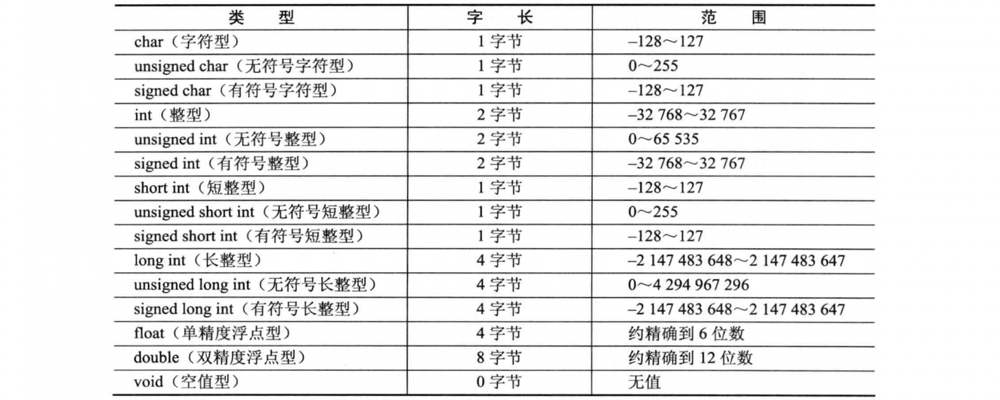

&emsp;
# Data Types 数据类型

数据类型在不同的 `操作系统` 或 `硬件平台` 中，这些数据类型的 `值域范围` 和 `所占用的内存的数量` 有关
- char 字符型
- int 整型
- float 单精度浮点型
- double 双精度浮点型
- void 空类型        


&emsp;
# 1 进制
## 1.1 *有关进制的思考
我们习惯的进制是十进制，计算机里面常用的是二进制、八进制、十六进制
>思考：有没有三进制、五进制、十三进制...？

随机定一个进制，比如3进制
```
三进制表示个位数：0 1 2

十进制表示：1 -> 三进制表示：1
十进制表示：2 -> 三进制表示：2
十进制表示：3 -> 三进制表示：10
十进制表示：4 -> 三进制表示：11
十进制表示：5 -> 三进制表示：12
```
&emsp;
## 1.2 位、字节
>位 (bit) 
- 来自英文 bit，音译为“比特”，表示二进制位
- 位是计算机 `内部数据储存` 的最小单位，11010100是一个 8 位二进制数
- 一个二进制位只可以表示 `0` 和 `1` 两种状态: 两个二进制位可以表示 00、01、10、11 共4个数；三位二进制数可表示八个数……
- $n$ 位二进制可以表示的数字(数量): $2^{n}$ 个

>字节 (Byte)
- 字节来自英文 Byte，习惯上用大写的 `B` 表示
- 字节是计算机中 `数据处理` 的基本单位，计算机中以字节为单位存储和解释信息，规定一个字节由八个二进制位构成，即 1 个字节等于 8 个比特（1Byte=8bit）。八位二进制数最小为 00000000（十六进制：00），最大为 11111111（十六进制：FF）；通常 1 个字节可以存入一个 ASCII 码，2 个字节可以存放一个汉字国标码


&emsp;
## 1.3 *数字在计算机中的存储
>无符号规则 unsigned
- 可以直接转换
    ```
    1001 1010 十六进制0x9A 十进制 154
    ```
>有符号规则
- 最高位是符号位：1（负数）， 0（正数）
- 原码：最高位是符号位，对齐它的为进行本身绝对值即可
- 反码：
    - 正数：反码和原码相同
    - 负数：符号位一定是1，其余为对原码取反
- 补码：
    - 正数：补码和原码相同
    - 负数：符号位一定是1，反码+1
    ```
    以下例子都是 8 位
    -9在计算机的表示：1111 0111
    原码： 1000 1001
    反码： 1111 0110
    补码： 1111 0111
    ~-9 = 0000 1000（按位取反）

    -12在计算机的表示：1000 1100
    原码： 1000 1100
    反码： 1111 0011
    补码： 1111 0100
    ~12 = 0000 1011（按位取反）

    -15在计算机的表示：
    原码： 1000 1111
    反码： 1111 0000
    补码： 1111 0001
    ~15 = 0000 1110（按位取反）
    ```

&emsp;
>查看数据在计算机中的存储
```c++
#include <iostream>
#include <bitset>
using namespace std;

int main(){

   short s = 35; // 35=2^5 + 2^1 + 1
   // 按 8 位输出
   cout << bitset<8>(s) << endl; // 00100011

   return 0;
}
```
>拓展
- 计算机中浮点数的表示形式：`IEEE754`


&emsp;&emsp;
# 2 基本类型的字长与范围

## 2.1 基本数据类型

- 数据类型其实就是告诉计算机要存储的数据占多少空间
- 计算机的内存是以字节（byte）为单位组织的
- 不同的设备、操作系统会有不同的显示


&emsp;
>查看本机数据类型的字节数
```c++
#include<stdio.h> //包含标准输入输出函数库

int main ()  //主函数
{
    printf("字符型char字长为%d\n", (int)(sizeof(char)));     //输出字符型字长 
    printf("整型int字长为%d\n", (int)sizeof(int));          //输出整型字长
    printf("单精度浮点型float字长为%d\n", (int)sizeof(float));  //输出单精度浮点型字长 
    printf("双精度浮点型double字长为%d\n", (int)sizeof (double)); //输出双精度浮点型字长 
    
    return 0; 
}
```
&emsp;
## 2.2 聚合类型和修饰符
除 void 类型外，基本类型的前面可以有各种修饰符。修饰符用来改变基本类型的意义，以便更准确地适应各种情况的需求
>修饰符
```c++
signed（有符号）    
unsigned（无符号）
long（长型）
short（短型）
```
- signed、short、long 和 unsigned 修饰符适用于 **char** 和 **int** 两种基本类型      
- long 还可用于 double    
- unsigned 和 signed 修饰符分别表示无正负值符号和有正负值符号的数据类型，计算机中原始数据类型使用的是二进制数，如果要表示正负值符号则需要用 1 位存储空间。以字符型为例，无符号字符型取值值域是 2^8，那么其取值范围为 0～255，有符号字符型将1位用于存储符号，取值值域是2^8-1，那么范围为-128～127
- 因为数据类型的默认定义是有符号数，所以 singed 修饰符通常可省略
- 为了使用方便，GCC 编译程序允许使用整型的简写形式: short int 表示为 short，即 int 可省略
- 表示正数时，最大能表示的值总是比值域少 1，这是因为将 0 作为正数看待，0占用了一个取值空间


</div align=center>
    <image src="images/ANSI_C2.png" width=800>
<div>


>查看数据类型所占字节大小
```c++
printf("%d\n", sizeof(数据类型));
cout << sizeof(数据类型) << endl;
```


&emsp;
# 3 指针（Pointer）
- 指针是“指向（point to）”另外一种类型的复合类型。复合类型是指基于其它类型定义的类型。
- 因此可以理解为：指针是程序数据在内存中的地址，而指针变量是用来保存这些地址的变量。

- 理解指针，先从内存说起：内存是一个很大的，线性的字节数组。每一个字节都是固定的大小，由8个二进制位组成。

- 程序加载到内存中后，在程序中使用的变量、常量、函数等数据，都有自己唯一的一个编号，这个编号就是这个数据的地址。

- 指针的值实质是内存单元（即字节）的编号，指针单独从数值上看，也是整数，他们一般用16进制表示。指针的值（虚拟地址值，相关知识点在操作系统）使用一个机器字的大小来存储,也就是说,对于一个机器字为n位的电脑而言,它的虚拟地址空间是0~[2的n次幂] - 1,程序最多能访问2的w次幂个字节。32位系统最大支持4GB内存的原因了。

>几个符号
- `*`
    - 声明指针
        ```cpp
        int* ptr;
        ```
    - 解引用 
        ```cpp
        int a = 10;
        int* ptr = &a;
        int b = *ptr; // Value pointed by
        ```
- `&`
    - 取址
        ```cpp
        int a = 10;
        int* ptr = &a;
        ```
    - 引用
        ```cpp
        int a  = 10;
        int& b = a;
        ```

>示例
```cpp
#include <stdio.h>

int main()
{
    int a    = 15;
    int& b   = a;
    int c    = a;
    int* ptr = &a;
    // &a 取变量 a 的地址
    printf("Value of a: %d\n", a);
    printf("Address of a: %p\n", &a); 
    printf("\n");

    // &b 引用，b 相当于是 a 的别名，是同一块内存的数据
    printf("Value of b: %d\n", b);    
    printf("Address of b: %p\n", &b);
    printf("\n");

    // c 是另外声明的变量，只是把 a 的值赋给 c
    printf("Value of c: %d\n", c);
    printf("Address of c: %p\n", &c);
    printf("\n");

    printf("Value of ptr: %p\n", ptr);
    printf("Address of ptr: %p\n", &ptr); // & 取 ptr 的内存地址
    printf("Value pointed by ptr: %d\n", *ptr); // 取 ptr 指向的值

    return 0;
}
```


