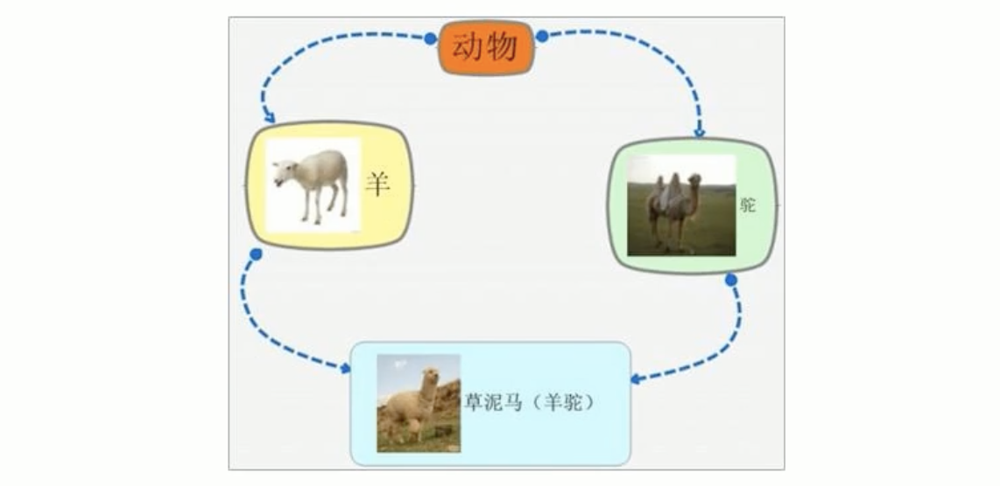

&emsp;
# 6 多继承语法
&emsp;&emsp;C++允许一个类继承多个类（一个儿子认多个爹），实际不建议用，了解即可
>语法
```c++
class 子类 : 继承方式 父类1, 继承方式 父类2...
```

>示例
```c++
class Base1
{
public :
    Base1(){m_A = 100;}

    int m_A;
};

class Base2
{
public :
    Base2(){m_A = 200;}

    int m_A;
};

class Son : public Base1, public Base2
{
public :
    Son(){
        m_C = 300;
        m_D = 400;
    }
    int m_C;
    int m_D;
};

int main()
{
    Son s;
    cout << sizeof(s) << endl;
    cout << s.Base1::m_A << endl;
    cout << s.Base2::m_A << endl;

    return 0;
}

```


&emsp;
# 7 菱形继承问题以及虚继承

>菱形继承（钻石继承）概念：
- 两个派生类继承同一个基类
- 又有某个类同时继承两个派生类


>菱形继承的问题
- 会有歧义，调用哪个父类的成员不明确
- 有两份数据，不符合常识或浪费资源

>解决方法
- 用加作用域、虚继承解决这个问题

>示例，不加 virtual 关键字
```c++
#include <iostream>
using namespace std;

class Base
{
    public :
        int m_Age;
};

class Son1 : public Base{};
class Son2 : public Base{};
class Grandson : public Son1, public Son2{};

int main()
{
    Grandson g;
    g.Son1::m_Age = 10; // 通过加作用域赋值
    g.Son2::m_Age = 20; 

    cout << g.Son1::m_Age << endl; // 通过加作用域调用
    cout << g.Son2::m_Age << endl;
    
    return 0;
}
```
>示例，加 virtual 关键字
```c++
#include <iostream>
using namespace std;

class Base
{
    public :
        int m_Age;
};

class Son1 : virtual public Base{};
class Son2 : virtual public Base{};
class Grandson : public Son1, public Son2{};

int main()
{
    Grandson g;
    g.Son1::m_Age = 10; 
    g.Son2::m_Age = 20; // 加 virtual 关键字后只有一份数据，最后一次赋值有效

    cout << g.m_Age << endl; // 可以直接通过 .属性 调用

    // // 下面两行输出的是同一份数据   
    // cout << &g.Son1::m_Age << endl; 
    // cout << &g.Son2::m_Age << endl;
    
    return 0;
}
```