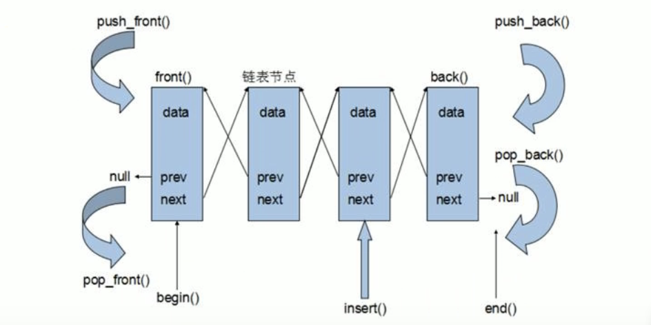

&emsp;
# List


&emsp;
# 1 基本概念
链表（list）是一种物理存储单元上非连续的存储结构，数据元素的逻辑顺序是通过链表中的之后怎链接实现的。

- 链表的组成：链表由一系列节点组成
- 节点的组成：一个是存储数据元素的数据域，另一个是存储下一个节点地址的指针域

STL中的链表是一个双向循环链表
- 由于链表的存储方式并不是连续的内存空间，因此链表list中的迭代器只支持前移和后移，属于双向迭代器



>优点
- 可以对任意位置进行快速插入或删除元素
- 采用动态存储分配，不会造成内存浪费和溢出
>缺点
- 对容器的遍历速度没有数组快
- 占用空间比数组大


&emsp;
# 2 构造函数
>函数原型
```c++
list<T> lis;           // list采用模板类实现，对象的默认构造形式
list(begin, end);      // 构造函数将[begin, end)区间中的元素拷贝给本身
list(n, elem);         // 构造函数将n个elem拷贝给本身
list(const list &lis); // 拷贝构造函数
```

>示例
```c++
#include <iostream>
#include <list>
using namespace std;

void printList(const list<int>&l)
{
    for (list<int>::const_iterator it = l.begin(); it != l.end(); it++)
    {
        cout << *it << " ";
    }cout << endl;
}

int main()
{
    list<int>L1;

    L1.push_back(10);
    L1.push_back(20);
    L1.push_back(30);
    L1.push_back(40);
    printList(L1);

    list<int>L2(L1.begin(), L1.end());
    printList(L2);

    list<int>L3(L2);
    printList(L3);

    list<int>L4(3, 888);
    printList(L4);

    return 0;
}
```


&emsp;
# 3 赋值和交换
>函数原型
```c++
assign(begin, end);  // 将[begin, end)区间中的数据拷贝赋值给本身
assign(n, elem);     // 将 n 个 elem 拷贝赋值给本身
list& operator = (const list& lis); // 重载等号操作符
swap(lis);           // 将 lis 与本身的元素互换
```
>示例
```c++
#include <iostream>
#include <list>
using namespace std;

void printList(const list<int>&l)
{
    for (list<int>::const_iterator it = l.begin(); it != l.end(); it++)
    {
        cout << *it << " ";
    }cout << endl;
}

int main()
{
    list<int>L1;
    L1.push_back(10);
    L1.push_back(20);
    L1.push_back(30);
    L1.push_back(40);
    printList(L1);

    list<int>L2;
    L2 = L1;
    printList(L2);

    list<int>L3;
    L3.assign(L2.begin(), L2.end());
    printList(L3);

    list<int>L4;
    L4.assign(5, 888);
    printList(L4);

    list<int>L5;
    L5.assign(4, 100);
    L1.swap(L5);
    printList(L1);
    printList(L5);
    return 0;
}
```

&emsp;
# 4 大小操作
>函数原型
```c++
size();            // 返回容器中元素的个数
empty();           // 判断容器是否为空
resize(num);       // 重新制定容器的长度为 num，若容器变长，则以默认值填充新的位置
                   // 如果容器变短，则末尾超出容器长度的元素被删除
resize(num, elem); // 重新制定容器的长度为num，若容器变长，则以elem值填充新位置
                   // 若容器变短，则末尾超出容器长度的元素被删除
```
>示例
```c++
#include <iostream>
#include <list>
using namespace std;

void printList(const list<int>&l)
{
    for (list<int>::const_iterator it = l.begin(); it != l.end(); it++)
    {
        cout << *it << " ";
    }cout << endl;
}

int main()
{
    list<int>L1;
    L1.push_back(10);
    L1.push_back(20);
    L1.push_back(30);
    L1.push_back(40);
    printList(L1);

    cout << L1.empty() << endl;
    cout << L1.size()  << endl;

    L1.resize(10, 888);
    printList(L1);
    
    L1.resize(2);
    printList(L1);

    return 0;
}
```

&emsp;
# 5 插入和删除
>函数原型
```c++
push_back(elem);         // 在容器尾部加入一个元素
pop_back();              // 删除容器中最后一个元素
push_front(elem);        // 在容器开头插入一个元素
pop_front();             // 在容器开头移除第一个元素
insert(pos, elem);       // 在 pos 插入 elem元素的拷贝，返回新数据的位置
insert(pos, n, elem);    // 在 pos 插入 n 个 elem 数据，无返回值
insert(pos, begin, end); // 在 pos 位置插入[begin, end) 区间的数据，无返回值
clear();                 // 移除容器的所有数据
erase(bein, end);        // 删除[begin, end)区间的数据，返回下一个数据的位置
erase(pos);              // 删除 pos 位置的数据，返回下一个数据的位置
remove(elem);            // 删除容器中所有与elem值匹配的元素
```

>示例
```c++
#include <iostream>
#include <list>
using namespace std;

void printList(const list<int>&l)
{
    for (list<int>::const_iterator it = l.begin(); it != l.end(); it++)
    {
        cout << *it << " ";
    }cout << endl;
}

int main()
{
    list<int>L1;
    L1.push_back(10);
    L1.push_back(20);
    L1.push_back(30);
    L1.push_front(111);
    L1.push_front(222);
    L1.push_front(333);
    printList(L1);
    
    L1.pop_back();
    L1.pop_front();
    printList(L1);

    list<int>::iterator it = L1.begin();
    L1.insert(++it, 888);
    printList(L1);

    it = L1.begin();
    L1.erase(it);
    printList(L1);

    L1.push_back(111);
    printList(L1);

    L1.remove(111);
    printList(L1);

    return 0;
}
```


&emsp;
# 6 数据存取
- 迭代器不支持随机访问

>函数原型
```c++
front(); // 返回第一个元素
back();  // 
```
>示例
```c++
#include <iostream>
#include <list>
using namespace std;

void printList(const list<int>&l)
{
    for (list<int>::const_iterator it = l.begin(); it != l.end(); it++)
    {
        cout << *it << " ";
    }cout << endl;
}

int main()
{
    list<int>L1;
    L1.push_back(10);
    L1.push_back(20);
    L1.push_back(30);
    L1.push_back(40);
    
    cout << L1.front() << endl;
    cout << L1.back() << endl;
    
    return 0;
}
```

&emsp;
# 7 翻转和排序
>函数原型
```c++
reverse(); // 反转链表
sort();    // 链表排序
```

>示例
```c++
#include <iostream>
#include <list>
using namespace std;

void printList(const list<int>&l)
{
    for (list<int>::const_iterator it = l.begin(); it != l.end(); it++)
    {
        cout << *it << " ";
    }cout << endl;
}

int main()
{
    list<int>L1;
    L1.push_back(10);
    L1.push_back(20);
    L1.push_back(30);
    L1.push_back(40);
    
    cout << L1.front() << endl;
    cout << L1.back() << endl;
    printList(L1);
    L1.reverse();
    printList(L1);
    
    return 0;
}
```


