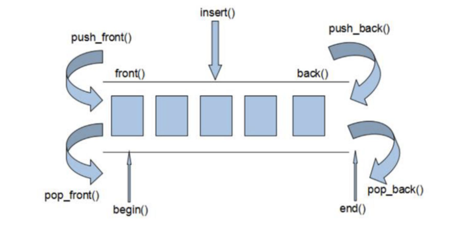

&emsp;
# Vector容器


&emsp;
# 1 基本概念
- vector数据结构和数组非常相似，也称为单端数组

>vector与普通数组区别
- 数组是静态空间，而vector可以动态扩展

>动态扩展
- 不是在原空间之后续接新空间，而是找更大的内存空间，然后将原数据拷贝到新空间，释放原空间

&emsp;
# 2 vector构造函数

>函数原型
```c++
vector<T> v;               // 采用模板实现类实现，默认构造函数
vector<T> v(size);         // 构造一个 size 大小的 vector
vector(v.begin(), v.end()) // 将v[begin(), end())区间中的元素拷贝给本身
vector(n, elem);           // 构造函数将n个elem拷贝给本身
vector(const vector &vec); // 拷贝构造函数
```

>示例
```c++
#include <iostream>
#include <vector>
using namespace std;

void printVector(vector<int>&v)
{
    for (vector<int>::iterator it = v.begin(); it != v.end(); it++)
    {
        cout << *it << " ";
    }cout << endl;
}

void printVector2(vector<int>& var)
{
    for (const auto&item : var)
        cout << item << " ";
    cout << endl;
}

int main()
{
    vector<int>v1;
    for (int i = 0; i < 10; i++)
    {
        v1.push_back(i);
    }
    vector<int>v2(v1.begin(), v1.end());
    vector<int>v3(10, 100);
    vector<int>v4(v3);
    printVector(v1);
    printVector(v2);
    printVector(v3);
    printVector(v4);
    return 0;
}
```

&emsp;
# 3 赋值操作
>函数原型
```c++
vector& operator=(const vector &vec); // 重载等号操作符
assign(v.begin(), v.end());  // 将v[begin, end)区间中的数据拷贝赋值给本身
assign(n, elem);     // 将n个elem拷贝赋值给本身
```
>示例
```c++
#include <iostream>
#include <vector>
using namespace std;

void printVector(vector<int>& v)
{
    for (vector<int>::iterator it = v.begin(); it != v.end(); it++)
    {
        cout << *it << " ";
    }cout << endl;
}

int main()
{
    vector<int>v1;
    for (int i = 0; i < 10; i++)
    {
        v1.push_back(i);
    }
    printVector(v1);

    vector<int>v2;
    v2 = v1;
    printVector(v2);

    vector<int>v3;
    v3.assign(v1.begin(), v1.end());
    printVector(v3);

    vector<int>v4;
    v4.assign(10, 100);
    printVector(v4);
}
```


&emsp;
# 4 数据访问
>函数原型
```c++
at(int idx); // 返回索引idx所指的数据
operator[];  // 返回索引idx所指的数据
front();     // 返回容器中第一个数据元素
back();      // 返回容器中最后一个数据元素
```

>示例
```c++
#include <iostream>
#include <vector>
using namespace std;

void printVector(vector<int>& v)
{
    for (vector<int>::iterator it = v.begin(); it != v.end(); it++)
    {
        cout << *it << " ";
    }cout << endl;
}

int main()
{
    vector<int> v1;
    for (int i = 0; i < 10; i++)
    {
        v1.push_back(i);
    }
    printVector(v1);
    cout << v1.at(3) << endl;
    cout << v1[1] << endl;
    cout << v1.front() << endl;
    cout << v1.back() << endl;
}
```
